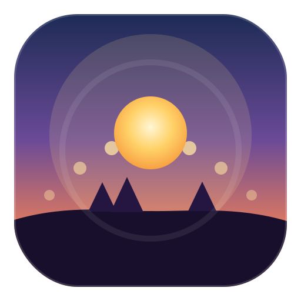
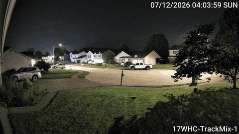
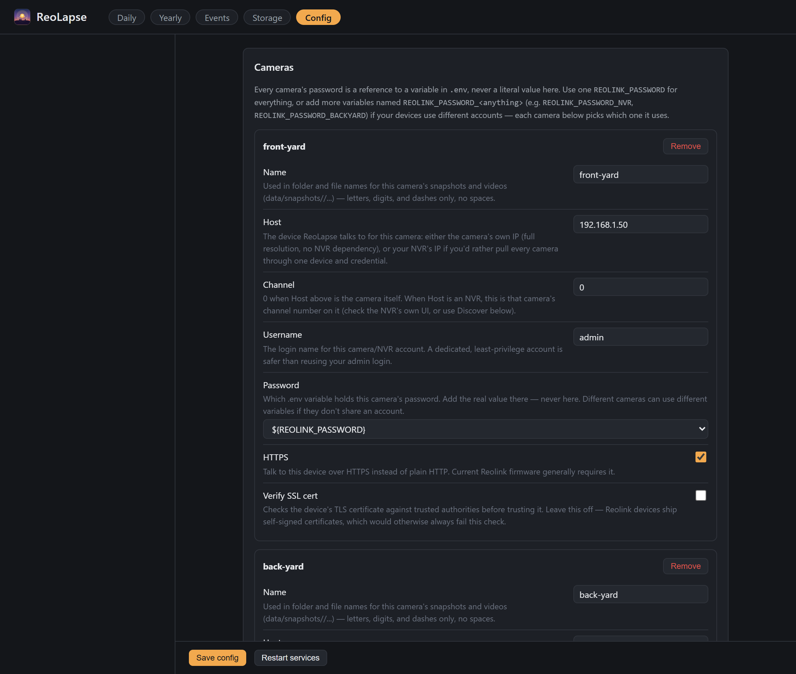
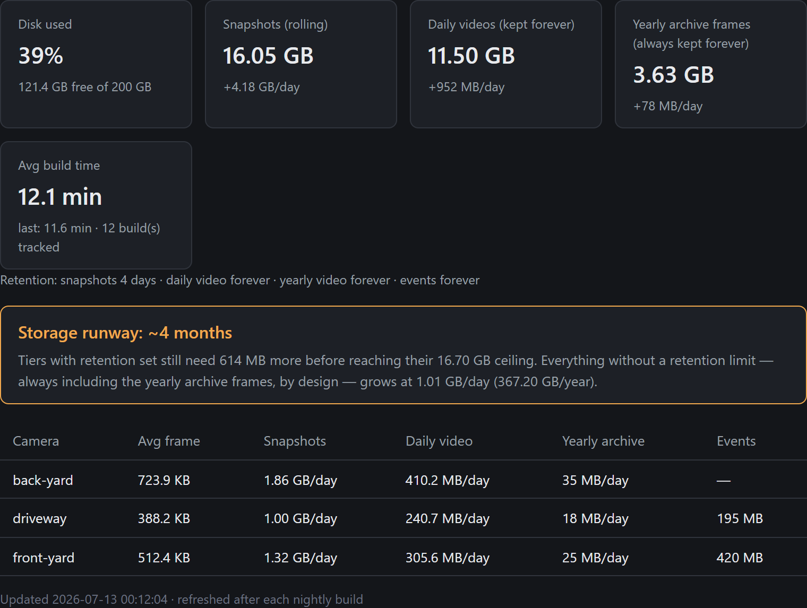

<p align="center">
  
</p>

<h1 align="center">ReoLapse</h1>

<p align="center">
  Turn your Reolink cameras (or NVR) into daily, yearly, and storm timelapses —<br>
  deflickered, weather-aware, and browsable from a small built-in web UI.
</p>

<p align="center">
  <a href="https://github.com/SeriesOfTubez/reolapse/actions/workflows/security.yml"></a>
  <a href="LICENSE"></a>
  
</p>

ReoLapse polls a snapshot from each camera on an interval, builds a
deflickered **daily** video per camera, archives frames into an ever-growing
**yearly** "changing seasons" video, and — when severe weather rolls in —
captures faster and cuts a dedicated **event** clip. Everything is browsable
through a bundled single-page web app.

<p align="center">
  
  <br>
  <em>A slice of one daily timelapse — pre-dawn to sunrise, captured on an interval through an NVR and built automatically overnight.</em>
</p>

> **Two things to know before you run this:** the web UI has no login by
> default — video browsing is always open, and the Config page has an
> optional passcode (see [Security](#security) — this is a LAN tool, don't
> expose it to the internet), and this project was built with AI assistance (see
> [AI-assisted development](#ai-assisted-development) for what that means and
> what's checked before anything ships).

---

## Features

- **Daily timelapses** per camera, with ffmpeg `deflicker` to tame
  auto-exposure flicker.
- **Yearly "seasons" timelapse.** Frames are archived hourly and kept forever;
  the yearly video is rendered from a configurable, re-tunable subset
  (e.g. 10 frames/day within daylight hours ≈ a 2-minute year). It holds off
  rendering until a configurable number of days have accumulated (30 by
  default) so you don't get a pointless two-second clip in the first week.
- **Weather-aware storm bursts.** Polls NWS alerts + Open-Meteo (free, no API
  keys). During storms/snow it captures every 10s instead of every 60s, and
  the nightly build cuts a per-storm clip.
- **Lunar event detection.** Computes full/blue/harvest moons and lunar
  eclipses (blood moon = total) locally via Skyfield — no location or API
  needed.
- **Season tagging.** Every frame and video is tagged with its astronomical
  season (spring/summer/fall/winter), hemisphere-aware — useful for filtering
  once a search UI exists, and it's what "changing seasons" is about anyway.
- **Frame & video tagging.** Active conditions (`storm`, `snow`, `rain`,
  `full-moon`, `blue-moon`, `harvest-moon`, `blood-moon`, `lunar-eclipse`,
  the season) are logged and embedded in each JPEG's comment and each video's
  metadata, so the data stays self-describing and searchable later.
- **PTZ-aware.** For auto-tracking cameras, frames captured away from the
  camera's home position are quarantined so they don't jerk the timelapse.
- **Direct or via NVR.** Talk to each camera directly, or pull every channel
  through one Reolink NVR with a single credential.
- **Bundled web UI.** Browse Daily / Yearly / Event videos per camera, with
  playback-speed controls and downloads. Range requests supported for seeking.
  Daily/event videos are grouped into a collapsible year/month tree once
  there are enough of them to need one.
- **Accent color.** Pick from six preset colors (`webapp.accent_color`) —
  amber (default), green, blue, red, purple, yellow.
- **Config page.** Edit `config.yaml` from the browser — every setting except
  secrets, which stay read-only and env-var-only. Includes network discovery
  to find Reolink cameras/NVRs on your LAN. See
  [Config page & network discovery](#config-page--network-discovery).
- **Storage dashboard.** A Storage tab shows per-camera and system-wide disk
  usage, growth rate, average build time, current retention settings, and a
  shortage/excess forecast — updated automatically after every nightly build.
  See [Storage estimates](#storage-estimates).
- **Configurable retention for every video tier.** Daily, yearly, and event
  videos default to being kept forever, but each has its own independent
  retention option if you'd rather bound disk usage.
- **Runs anywhere.** A Linux VM with systemd units, or Docker Compose.
- **Secrets stay out of the repo.** Credentials live in `.env`, referenced from
  config as `${VAR}`. Multiple cameras/NVRs with different accounts just get
  multiple `REOLINK_PASSWORD_*` variables — the Config page's password field
  lists whichever ones you've defined.

## Supported hardware

Any Reolink device that exposes the HTTP **`Snap`** CGI command — which is
essentially all current cameras and NVRs. It works both ways, so use whichever
is convenient:

- **Through an NVR** (`host` = NVR IP, `channel` = the camera's channel) — one
  host and one credential for every camera. Convenient for pulling several
  cameras, and needed if they sit on the NVR's isolated PoE network.
- **Directly** to a camera (`host` = camera IP, `channel: 0`) — no NVR
  dependency, and the only way to reach a lens the NVR doesn't expose (e.g. a
  dual-lens camera's second lens).

Both return the same full-resolution main-stream snapshot on current hardware
(verified on an RLN36 as byte-for-byte identical). Some older NVRs may hand
back a reduced-resolution snapshot for a channel — if you see that, pull that
camera directly instead.

Developed and tested against a Reolink **RLN36** NVR with **TrackMix WiFi**,
**OMVI 3i**, and **Video Doorbell WiFi** cameras (HTTPS, self-signed certs).
Other models exposing the same API should work; reports welcome.

> **Note on multi-lens cameras:** an NVR exposes one feed per camera. To
> capture a second lens (e.g. a dual-lens unit's wide + tele), address that
> camera directly and add each lens as its own `channel`.

> **Home Hub / Home Hub Pro (untested):** the Home Hub exposes the same CGI
> API and presents its cameras as channels behind the hub's IP, so in
> principle it should work exactly like an NVR — set `host` to the hub and a
> `channel` per camera. This is inferred from Reolink's API and the official
> Home Assistant integration (which fully supports the hubs); it hasn't been
> tested with ReoLapse yet, so reports are very welcome. **Caveat for battery
> cameras:** requesting a snapshot wakes a sleeping battery camera for
> 10–30s, so ReoLapse's interval polling would keep it awake and drain the
> battery fast. Only practical with **continuously-powered** cameras behind
> the hub (wired, or a battery cam left on permanent USB power).

## How it works

```
                 capture.py  ── Snap API ──►  cameras / NVR
                     │
     writes JPEGs +  ▼
     conditions log  data/snapshots/<cam>/<date>/<HHMMSS>.jpg
                     │
   build_timelapse.py│  (nightly + weekly)
                     ├─►  data/videos/<cam>/daily/<date>.mp4
                     ├─►  data/videos/<cam>/events/<date>_<tag>.mp4
                     ├─►  data/yearly_frames/<cam>/<year>/…   (kept forever)
                     ├─►  data/videos/<cam>/yearly/<year>.mp4
                     └─►  data/storage_stats.json  (storage_stats.py)
                     │
        webapp/app.py▼  serves the SPA + videos on :8080
```

Snapshots are pruned after `keep_snapshots_days`, but **only** once a day's
daily video exists — a missed build never silently loses a day. Yearly archive
frames are never pruned.

## Requirements

- Python 3.9+
- ffmpeg on `PATH`
- Reolink camera(s) and/or NVR reachable on your network
- A CPU exposing the **x86-64-v2** instruction baseline (SSE4.1, SSE4.2,
  POPCNT — needed by NumPy, which Skyfield uses for lunar event detection).
  Any real CPU from the last ~15 years has this. **Running in a VM (Proxmox,
  KVM, ESXi, etc.)?** Generic/portable virtual CPU types (e.g. Proxmox's
  default `kvm64`/`qemu64`, which reports as "Common KVM processor") often
  expose only SSE2 and will *not* meet this baseline — NumPy fails at runtime
  and lunar tagging silently stops working (everything else is unaffected).
  Set the VM's CPU type to `host` (passes through the physical CPU, best
  performance) or a synthetic type that guarantees v2+, such as
  `x86-64-v2-AES` or `x86-64-v3`, then reboot the VM. Verify with:
  `grep -o 'sse4_2\|popcnt' /proc/cpuinfo` — if that prints nothing, the
  baseline isn't met.

## Quick start (Docker)

```bash
git clone https://github.com/SeriesOfTubez/reolapse.git
cd reolapse

cp config.example.yaml config.yaml   # edit: cameras, location, options
cp .env.example .env                 # set REOLINK_PASSWORD

docker compose up -d --build
```

Open <http://localhost:8080>. Three services start: `capture` (continuous),
`scheduler` (nightly/weekly builds), and `web`. Keep `storage.root: ./data` in
`config.yaml` so data lands on the Docker volume.

## Install on a Linux VM (systemd)

> **Running this in a VM?** Make sure the hypervisor exposes at least the
> x86-64-v2 CPU baseline to the guest — see [Requirements](#requirements).
> Proxmox's default CPU type doesn't; `host` or `x86-64-v3` does.

### Easy install (one command)

For a Debian/Ubuntu host with systemd. Installs the system packages, clones into
`/opt/reolapse`, sets up the virtualenv, installs and enables the systemd units
**for the user running the script** (retargeting the units' default `User=`, so
you don't need an `ubuntu` user), starts the web UI, and (unless you opt out)
adds the scoped sudo rule for the Config page's Restart button:

```bash
curl -fsSL https://raw.githubusercontent.com/SeriesOfTubez/reolapse/main/install.sh | bash
```

Piping a script into your shell means running it unread — reasonable to look
first (a good habit for any `curl | bash`):

```bash
curl -fsSL https://raw.githubusercontent.com/SeriesOfTubez/reolapse/main/install.sh -o install.sh
less install.sh
bash install.sh
```

Run it as a normal user with sudo — **not** as root. It deliberately stops short
of capturing: you still fill in `config.yaml` and `.env` (or use the web UI's
Config tab), then `sudo systemctl start reolapse-capture.service` — the script
prints the exact next steps. Env-var options: `REOLAPSE_DIR=` (install location),
`REOLAPSE_BRANCH=`, `REOLAPSE_SKIP_SUDOERS=1`.

### Manual install

```bash
sudo mkdir -p /opt/reolapse && sudo chown "$USER" /opt/reolapse
git clone https://github.com/SeriesOfTubez/reolapse.git /opt/reolapse
cd /opt/reolapse

sudo apt install -y ffmpeg
python3 -m venv venv && venv/bin/pip install -r requirements.txt

cp config.example.yaml config.yaml   # edit for your setup
cp .env.example .env                  # set REOLINK_PASSWORD
chmod 600 .env config.yaml
```

**What you must configure** before the services will work:

1. **`config.yaml`** — your cameras (host/channel/name), and optionally location
   and capture settings. See [Configuration](#configuration) below for every
   field.
2. **`.env`** — set `REOLINK_PASSWORD` (and any extra `REOLINK_PASSWORD_*`) to
   your real camera/NVR password(s). `config.yaml` only ever references these by
   name, never the literal value.

Test one capture before wiring up the services (`venv/bin/python capture.py -v` —
a JPEG should appear under `data/snapshots/…`).

**Then point the systemd units at your setup.** The units in `deploy/` are
written for the defaults **`User=ubuntu`** and **`/opt/reolapse`** — if either
differs for you they won't start, so retarget them first:

```bash
# Set User= to the account the services run as (skip if you really use "ubuntu"):
sed -i "s/^User=ubuntu$/User=$(id -un)/" deploy/*.service

# Only if you installed somewhere other than /opt/reolapse, fix the paths too:
# sed -i "s|/opt/reolapse|/your/install/path|g" deploy/*.service
```

Now install and enable them:

```bash
sudo cp deploy/*.service deploy/*.timer /etc/systemd/system/
sudo systemctl daemon-reload
sudo systemctl enable --now reolapse-capture.service \
     reolapse-web.service reolapse-daily.timer reolapse-yearly.timer
```

Finally, make sure ReoLapse knows your timezone so capture days line up with
your local midnight: either set `capture.timezone` (an IANA name like
`America/Chicago`), leave it blank to auto-detect from your `events.zip` /
latitude-longitude, or set the host clock (`sudo timedatectl set-timezone …`).
The config option is the most reliable — it doesn't depend on the host clock
being right.

**(Optional) Enable the Config page's Restart button.** A ready-made, scoped
sudo drop-in ships in `deploy/`. It also defaults to user `ubuntu`, so set it to
your account first (and confirm the `systemctl` path matches
`command -v systemctl` — it's `/usr/bin/systemctl` on most systems), then
validate and install it:

```bash
sed -i "s/^ubuntu /$(id -un) /" deploy/reolapse.sudoers   # set your user

sudo visudo -cf deploy/reolapse.sudoers \
  && sudo install -m 0440 -o root -g root deploy/reolapse.sudoers /etc/sudoers.d/reolapse
```

## Upgrading

Upgrades only change code — your `config.yaml`, `.env`, and `data/` are
gitignored (Linux) or on a named volume (Docker), so history and settings are
never touched.

**Linux (installed with `install.sh`):**

```bash
curl -fsSL https://raw.githubusercontent.com/SeriesOfTubez/reolapse/main/upgrade.sh | bash
```

…or `bash upgrade.sh` from your install dir. It fetches the latest release,
reinstalls dependencies, refreshes the systemd units, and restarts the
services. Pin a version with `REOLAPSE_REF=v0.2.0`, or track the tip of `main`
with `REOLAPSE_REF=main`.

**Docker:**

```bash
cd /path/to/reolapse && git pull && docker compose up -d --build
```

The `data` volume survives the rebuild.

Releases are tagged and listed on the
[Releases page](https://github.com/SeriesOfTubez/reolapse/releases). The running
version appears in the web UI header and in the capture/web service logs.

## Configuration

Everything lives in `config.yaml` (copy from `config.example.yaml`). Secrets do
not: reference them as `${VAR}` and put the values in `.env`. Highlights:

| Key | Meaning |
|---|---|
| `cameras[].host` / `channel` | Camera IP + `0`, or NVR IP + channel number |
| `cameras[].ptz_home` | Quarantine frames taken off a PTZ camera's home position |
| `capture.timezone` | IANA timezone for capture timing/day boundaries; blank auto-detects from location, else falls back to the host clock |
| `capture.interval_seconds` | Base capture cadence (default 60, minimum 10) |
| `capture.start_time`/`end_time` | Optional fixed daily capture window |
| `capture.daylight_window` | Capture only around actual sunrise/sunset instead of a fixed clock window — see [Night capture & IR cameras](#night-capture--ir-cameras) |
| `storage.keep_snapshots_days` | Retention for raw frames after their video builds |
| `daily_video.deflicker_size` | Deflicker window; `0` disables |
| `daily_video.retention_days` | Delete a daily video this many days after its date; `0` = forever |
| `yearly.min_days_before_render` | Wait until this many days are archived before rendering the yearly video (default 30); `0` renders as soon as any frames exist, `yearly --force` overrides once |
| `yearly.video_frames_per_day` / `video_window` | Pacing of the yearly video |
| `yearly.retention_years` | Delete a yearly video once it's this many years old; `0` = forever. Cheap to set low — see [Storage estimates](#storage-estimates) |
| `events.weather_enabled` | Storm/snow/rain tagging + burst capture (needs `events.zip` or `latitude`/`longitude`) |
| `events.lunar_enabled` | Moon-event tagging — no location required |
| `events.season_enabled` | Spring/summer/fall/winter tagging on frames + video metadata — no location required |
| `events_video.tags` | Which tags get their own `<date>_<tag>.mp4` clip (default `storm`, `snow`; any tag works, including moon events) |
| `events_video.deflicker_size` / `deflicker_by_tag` | Deflicker for event clips — off by default (protects lightning in storm clips), overridable per tag (e.g. enable for `snow`) |
| `events_video.retention_days` | Delete an event clip this many days after its date; `0` = forever |
| `webapp.accent_color` | UI accent color: `amber` (default), `green`, `blue`, `red`, `purple`, `yellow` |

See the inline comments in `config.example.yaml` for the full reference.

## Config page & network discovery

The **Config** tab edits `config.yaml` from the browser instead of by hand —
every setting above except secrets (see below) is exposed as a checkbox,
dropdown, radio, or text field.

<p align="center">
  
</p>

- **Passwords are always a variable reference, never a real value, in the
  UI.** Each camera's password field is a dropdown of `REOLINK_PASSWORD*`
  variables this server has loaded from `.env` (names only — the actual
  values never reach the browser); pick one, or choose "Custom" to reference
  a variable you haven't added to `.env` yet. The save endpoint independently
  rejects anything that isn't a `${VAR}` reference, so a literal password
  typed into the form can't end up in `config.yaml` even if the UI is
  bypassed.
- **Fields the UI doesn't have a control for are preserved as-is.** The page
  edits the config it fetched in place rather than rebuilding it from
  scratch, so things like a camera's `ptz_home` block or
  `events_video.deflicker_by_tag` survive a save untouched even though
  there's no form control for them yet.
- **Saving does not restart anything by itself.** The web UI picks up most
  changes on next page load (accent color is immediate), but `capture.py` and
  `build_timelapse.py` are separate processes — they only pick up a saved
  change after a restart.
- **Restart services button.** On a systemd deployment, the Config page's
  footer has a **Restart services** button that runs
  `systemctl restart reolapse-capture.service` and
  `reolapse-web.service` for you, so you don't need shell access just to
  apply a config change. It requires a narrowly-scoped passwordless sudo rule
  (only those two restart commands, nothing else). The **easy installer sets
  this up automatically**; for a manual install, install the ready-made
  `deploy/reolapse.sudoers` drop-in (see
  [Install on a Linux VM](#install-on-a-linux-vm-systemd)). Without the rule
  the button just fails with a clear error instead of hanging. Docker
  deployments don't have `systemctl` at all — the button detects this and
  tells you to run `docker compose restart` instead.
- **Comments are not preserved.** This editor round-trips the YAML as data,
  not text, so saving from the UI strips out `config.yaml`'s hand-written
  comments. A backup of the previous file is written to `config.yaml.bak`
  before every save.
- **Config page access (optional passcode).** The **Config page access**
  section at the bottom of the page lets you set a single passcode that gates
  this page and its write/scan endpoints — video browsing stays open. Setting
  the first passcode is allowed from the open page (it logs you straight in);
  changing or removing it afterward requires being logged in. See
  [Security](#security) for how it's stored and what it does and doesn't
  protect. Setting or changing the passcode also rewrites `config.yaml` (same
  `.bak` backup, same comment-stripping caveat as above).
- **Network discovery** (inside the Cameras section) scans your `/24` for
  Reolink devices and lists the ones it finds. An unauthenticated probe can
  only confirm a device is there, not what it is — click **Identify & add**
  on a result, supply credentials, and it fetches the real model/name/channel
  list before adding anything. The credentials you type there are used for
  that one lookup only and are never saved; you still need to add the real
  password to `.env` yourself before restarting capture. If a scan seems to
  miss a device, try it again — the first scan after a service restart can
  occasionally undercount on constrained hardware (observed on a 1-vCPU
  reference VM; consistently found everything on immediate re-runs).
  Discovery only sees whatever network the server itself is on — inside
  Docker's default bridge network, that's the container's private subnet,
  not your LAN; run outside Docker or add `network_mode: host` if you want
  discovery to work in a container.

## Storage estimates

<p align="center">
  
</p>

The **Storage** tab in the web UI shows live per-camera and system-wide usage
and daily growth (`storage_stats.py`, refreshed after every nightly build —
no guessing required once it's running). Before you get there, here's real
data from the reference deployment (3 Reolink cameras of different
resolutions, 1 frame/minute, all-day capture) to help you size disk up front:

| Camera | Resolution | Avg JPEG size | Raw snapshots/day | Daily video/day |
|---|---|---|---|---|
| Reolink Wired WiFi Doorbell | 2560×1920 (4.9 MP) | ~450 KB | ~0.6 GB | ~200 MB |
| Reolink TrackMix WiFi (Wide Cam) | 3840×2160 (8.3 MP) | ~1.3 MB | ~1.8 GB | ~290 MB |
| Reolink OMVI 3i WiFi (Fixed Cam) | 5120×1920 (9.8 MP) | ~1.7 MB | ~2.4 GB | ~470 MB |

Rough rule of thumb: **~0.1–0.2 MB per megapixel per frame**, varying with
scene complexity and each camera's own JPEG quality setting — the range above
spans 3 real cameras and isn't a tight line, so treat it as a ballpark, not a
formula. For a precise number, check the actual size of a few files in
`data/snapshots/<camera>/` and multiply by how many frames/day you'll capture
(`86400 / capture.interval_seconds`, or less if `start_time`/`end_time` is set).

What accumulates and what doesn't, and how to bound each:

- **Raw snapshots** are a *rolling window* — pruned `storage.keep_snapshots_days`
  after each day's video builds, so this cost is already bounded by default.
- **Daily videos, yearly videos, and event clips default to forever** (`0` in
  `daily_video.retention_days`, `yearly.retention_years`,
  `events_video.retention_days`) but each is independently configurable. In
  the reference 3-camera deployment, daily videos alone grow by **~0.9
  GB/day** — roughly **28 GB/month** or **340 GB/year** — unbounded by
  default, before adding storm/snow clips or a fourth camera.
- **Yearly *archive frames* (`data/yearly_frames/`) are never prunable, by
  design** — that's the permanent, irreplaceable source the yearly video is
  built from. This is why pruning a *yearly video* is cheap and safe: its
  frames are untouched, so `build_timelapse.py yearly --year YYYY`
  regenerates it any time. The frame archive itself is small regardless
  (well under 100 MB/day across 3 cameras) — it's not what threatens your disk.

### Retention & the storage forecast

The Storage tab shows your **current retention settings** for all four tiers
side by side, plus a **forecast**: it computes the eventual steady-state size
of every tier that has a retention limit set, and a growth rate for whatever
doesn't (the yearly archive frames always contribute here, since they can't
be bounded). From that it reports one of three verdicts against your current
free disk space:

- **Runway** — some tier still grows forever; shows how long until disk
  fills at the current rate (e.g. "~20 days").
- **Headroom** — every tier is bounded and there's room to spare once each
  reaches its ceiling.
- **Shortage** — the bounded tiers' ceilings alone already exceed your free
  space, before any unbounded growth is even considered.

This recalculates after every nightly build, so it tracks reality as your
retention settings, camera count, or event frequency change — no manual math
required.

## Performance

Reference deployment: a Proxmox VM with **1 vCPU and 1 GB RAM** (Ubuntu 26.04
cloud image), on a Proxmox host with an **Intel N95**. With 3 cameras and a
full day of frames (~1440/camera), the nightly build takes about **45–50
minutes** total and peaks around **700 MB RAM**. Encoding (`libx264`, default
preset `medium`) is the bottleneck; the hardlink/copy staging step is
comparatively instant.

Cameras currently build **sequentially, one at a time** (not in parallel), so
total build time is roughly the sum of each camera's encode time. Within a
single camera's encode, though, `libx264` threads automatically across
whatever cores are available — so **more vCPUs should speed up each camera's
build** (diminishing returns past ~8 threads), and a faster single-thread CPU
shortens it further. Neither has been benchmarked beyond the reference
1-vCPU deployment above; reports from other hardware are welcome.

If build time is a problem before you can add cores: lower `daily_video.max_height`
(fewer pixels to encode), `capture.interval_seconds` (fewer frames/day), or
the `preset` for the video type you're building (`daily_video.preset`,
`yearly.preset`, `events_video.preset` — faster x264 presets trade a larger
file for less CPU time). All are editable from the Config page.

The Storage tab tracks your **own** build times (an "avg build time" card,
averaged over the last 60 nightly builds) — that's the number to trust for
your actual hardware and camera count, not the reference figures above.

## Usage

```bash
# One-off / manual builds (the scheduler or systemd timers do these for you):
python build_timelapse.py daily                       # yesterday, all cameras
python build_timelapse.py daily --date 2026-07-04 --camera front-yard
python build_timelapse.py yearly --year 2026
python build_timelapse.py events --date 2026-07-15    # rebuild event clips

python capture.py --loop        # continuous capture (service/container does this)
python webapp/app.py            # serve the web UI
```

## Weather tagging & storm bursts

`events.weather_enabled` and `events.lunar_enabled` are independent
switches — turn on either, both, or neither.

With `events.weather_enabled: true` and a location set (`events.zip`, or
`latitude`/`longitude`), capture polls NWS + Open-Meteo every `poll_minutes`
for storm/snow/rain conditions. Active tags are appended to
`data/conditions/<date>.jsonl` and embedded in each frame as a JPEG comment
(`{"tags":["storm"]}`, visible in exiftool). Storms/snow trigger burst
capture, and the nightly build renders a clip per event span into the
**Events** tab. Deflicker for these clips is off by default (it would smooth
away lightning flashes) but is fully configurable — see
`events_video.deflicker_size` / `deflicker_by_tag` in the config table below
if you'd like it on for snow, which has no lightning to protect. If weather
tagging is enabled without a resolvable location, storm/snow tagging is
skipped and the web UI shows a warning banner.

## Lunar event detection

With `events.lunar_enabled: true`, ReoLapse computes real moon events — full
moon, blue moon, harvest moon, and lunar eclipses — using
[Skyfield](https://rhodesmill.org/skyfield/) and a local JPL ephemeris
(`de421.bsp`, ~17 MB, downloaded once into `data/ephemeris/`). **No location
is required**: a full moon happens at the same instant everywhere on Earth,
so the phase-based tags (`full-moon`, `blue-moon`, `harvest-moon`) work with
nothing else configured. This does need a CPU meeting the x86-64-v2 baseline
(see [Requirements](#requirements)) — on an under-specified VM it fails
silently, logging `event source failed: NumPy was built with baseline
optimizations...` while the rest of ReoLapse keeps working normally.

Eclipses are a little more subtle. The eclipse itself is also a geocentric
event, but *visibility* is not — only the hemisphere facing the Moon at that
moment can see it. If a location is configured (shared with the weather
settings), an eclipse is only tagged `blood-moon` (total) or `lunar-eclipse`
(partial) when the Moon was actually above your horizon for it; without a
location, every eclipse is tagged unconditionally since there's nothing to
check visibility against.

Lunar tags are metadata only by default — they don't trigger burst capture.
Add them to `events_video.tags` if you want an automatic clip, e.g.
`2026-03-03_blood-moon.mp4`.

## Season tagging

With `events.season_enabled: true`, every frame and video gets tagged with
its astronomical season (`spring`/`summer`/`fall`/`winter`), computed from
the real equinox/solstice instants each year via Skyfield — not a fixed
calendar approximation. No location is required: it defaults to Northern
Hemisphere seasons, which is right for most current users; set a location if
you're south of the equator so the tags flip correctly (July is winter
there, not summer).

Frames get it the same way as weather/lunar tags — a JPEG comment. Videos
get it as MP4 metadata (`season=summer`), readable with `ffprobe -show_format`
or exiftool. If you're curious why that needed a nonstandard `ffmpeg` flag:
the mov/mp4 muxer only writes a fixed whitelist of "known" keys (`comment`,
`artist`, …) by default and silently drops anything else, including custom
keys like `season` — `-movflags use_metadata_tags` turns that off.

## PTZ cameras

Add a `ptz_home` block (see `config.example.yaml`). Before each snapshot,
capture reads `GetPtzCurPos` and compares pan/tilt to the configured home;
off-home frames go to an `offposition/` subfolder — excluded from videos, still
pruned normally. Whichever axes the response includes are checked; an NVR
relays only pan (usually enough). Set `ptz_home.host` to the camera's own IP if
you need the tilt axis. The check fails open — a position-query error keeps the
frame.

## Night capture & IR cameras

If a camera relies on IR illumination at night, a 24-hour daily timelapse
will show a jarring color-to-black-and-white-and-back transition at the start
and end of every night — deflicker smooths *exposure* flicker, not a full
color-mode switch. Two ways to avoid it:

- **Disable IR** if the scene has enough ambient light without it (street
  lights, a porch light, etc.) — the camera stays in color all night, at the
  cost of more visible sensor noise in the dark. This is the reference
  deployment's setup and it works well; see the [Weather tagging](#weather-tagging--storm-bursts)
  and [Lunar event detection](#lunar-event-detection) sections above for why
  full 24-hour color capture is worth having if you can.
- **Capture only during daylight** with `capture.daylight_window` if IR needs
  to stay on. Unlike a fixed `start_time`/`end_time`, this is computed fresh
  every day from real sunrise/sunset for your location (`events.zip` or
  `latitude`/`longitude`, independent of whether weather/lunar tagging is
  enabled), so it tracks the seasons instead of drifting out of sync with
  them. `buffer_minutes` extends the window a bit past sunrise/sunset on each
  end, since IR typically doesn't kick in the instant the sun sets — tune it
  down if you still catch IR frames, or up if you're cutting off usable
  daylight.

We looked at a third option — asking the camera directly whether it's
currently in color or IR mode via `GetIsp`'s `dayNight` field — but that
field is the camera's **configured mode** (`Auto`/`Color`/`Black&White`), not
a live readout of which one is currently active. For a camera left on
`Auto` (the normal case), querying it just returns `"Auto"` and tells you
nothing about the moment-to-moment state, so it can't drive a per-frame
decision. The sunrise/sunset approach above doesn't have that problem.

### Night-only timelapses (night mode)

Set `capture.daylight_window.mode: night` (with the window `enabled`) to do the
**opposite** of daylight capture — record only the **dark hours** and skip the
day. It reuses the same sunrise/sunset math, just inverted; `buffer_minutes`
trims that much twilight off each end of the night instead of extending it.

Because a night spans midnight, night mode buckets frames by a **noon-to-noon
day**, so one evening plus the following morning become **one continuous video**
(labeled by the night's start date) instead of two half-clips split at midnight.
And since a night isn't finished until dawn, the nightly timer can't build it —
the **capture service builds each night automatically ~5 minutes after its
window closes at sunrise**. (A manual build still works:
`build_timelapse.py daily --date YYYY-MM-DD`.)

Night mode needs a location set (`events.zip` or `latitude`/`longitude`), same
as the daylight window. Leave `yearly.video_window` empty when using it — a
daylight-hours filter makes no sense for night frames.

## Security

- **There is no authentication.** The web UI has no login, no access control,
  nothing — anyone who can reach port 8080 can browse and download every
  video. **ReoLapse is a private, LAN-only tool. Do not port-forward it or
  otherwise expose it to the internet.** If you need remote access, put it on
  a VPN (Tailscale, WireGuard) or behind a reverse proxy that adds its own
  auth and TLS — don't rely on ReoLapse itself for either. This was a
  deliberate design choice, not an oversight: ReoLapse was built to run on
  your home network, so authentication was not a priority for MVP release.
  It may get added later if there's enough demand — open an issue if that's
  you.
- **The Config page can write `config.yaml` and scan your network — the
  no-auth warning above applies doubly to it.** Anyone who can reach the app
  can reconfigure your cameras or trigger a network scan; on an open install
  the LAN-only posture is what protects this, not anything in the app itself.
  The write endpoint does reject literal passwords (only `${VAR}` references
  are accepted) and validates structure before touching the file, and its
  `Content-Type: application/json` requirement means a plain cross-origin
  `<form>` POST from some other site can't trigger it — but a malicious page
  making a same-network JSON `fetch()` still could, same as it could hit any
  other unauthenticated route here.
- **Optional Config-page passcode.** You can put a single passcode (no
  username) in front of the Config page and its write/scan endpoints
  (`/api/config`, `/api/discover`, `/api/discover/identify`, `/api/restart`)
  while video browsing stays open for casual LAN viewing. It's **opt-in**:
  set it from the Config page itself under **Config page access** (or remove
  it there later). Details:
  - The passcode is stored only as a **salted scrypt hash** in `config.yaml`
    (`webapp.config_passcode_hash`) — never in the clear, and never sent to
    the browser. A hash is safe to keep there because, unlike a camera
    password, it never needs to be reversed.
  - A successful login sets an `HttpOnly`, `SameSite=Lax` session cookie
    (server-side token, 12-hour expiry). `SameSite=Lax` keeps the cookie off
    cross-site POST/`fetch`, so a malicious off-origin page can't ride your
    session to the write endpoints. Restarting the web service or changing
    the passcode logs every session out.
  - There's a modest failed-login throttle. This is a convenience gate for a
    trusted LAN, **not** a substitute for the VPN/reverse-proxy guidance
    above — the cookie rides over plain HTTP since ReoLapse serves no TLS.
- Credentials live in `.env` (gitignored), never in `config.yaml`.
- Prefer a **dedicated, least-privilege** camera/NVR account for ReoLapse. The
  Snap API passes credentials as URL parameters, so avoid `&`, `#`, `%` in that
  password.
- The bundled Flask server is a dev-grade WSGI server — fine for a trusted
  LAN, not a hardened production server.

## AI-assisted development

This project was built with AI pair-programming assistance (Claude, via
Claude Code) under human direction and review — most of the code and docs were AI-generated. If that's a dealbreaker for you,
that's a reasonable position; here's what's in place either way so you can
judge for yourself rather than take it on faith:

- **CI runs security scanning on every push and PR** (see the badge at the
  top of this README, and [`.github/workflows/security.yml`](.github/workflows/security.yml)):
  [Gitleaks](https://github.com/gitleaks/gitleaks) for committed secrets,
  [Semgrep](https://semgrep.dev/) for static analysis, and
  [Trivy](https://trivy.dev/) for dependency vulnerabilities, container image
  CVEs, and Dockerfile/IaC misconfiguration.
- Those scans have already changed real decisions in this repo — e.g. the
  Docker base image is Alpine instead of Debian-slim specifically because
  Trivy found hundreds of unfixed CVEs in the latter.
- All source is here to read; nothing is obfuscated, minified, or vendored
  without attribution. Issues and PRs are welcome, especially bug reports —
  AI assistance doesn't mean the code is beyond scrutiny, it means you get to
  scrutinize it instead of trusting a vendor's black box.

## Roadmap / ideas

- Re-encode old dailies at a lower bitrate instead of deleting them outright,
  as an alternative to `daily_video.retention_days` — see
  [Storage estimates](#storage-estimates).
- All-sky / long-exposure night camera support (Raspberry Pi HQ + Allsky).
- Object-storage (S3/Garage) backend for videos.
- Parallelize daily builds across cameras (currently sequential — see
  [Performance](#performance)).

## Contributing

Issues and PRs welcome — especially reports of which Reolink models work. Keep
changes focused and match the existing style.

## License

MIT — see [LICENSE](LICENSE).
