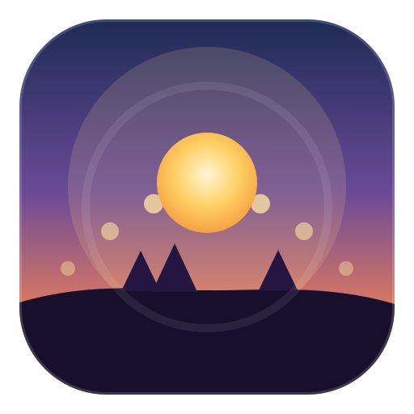
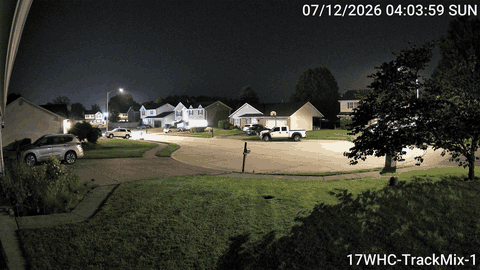
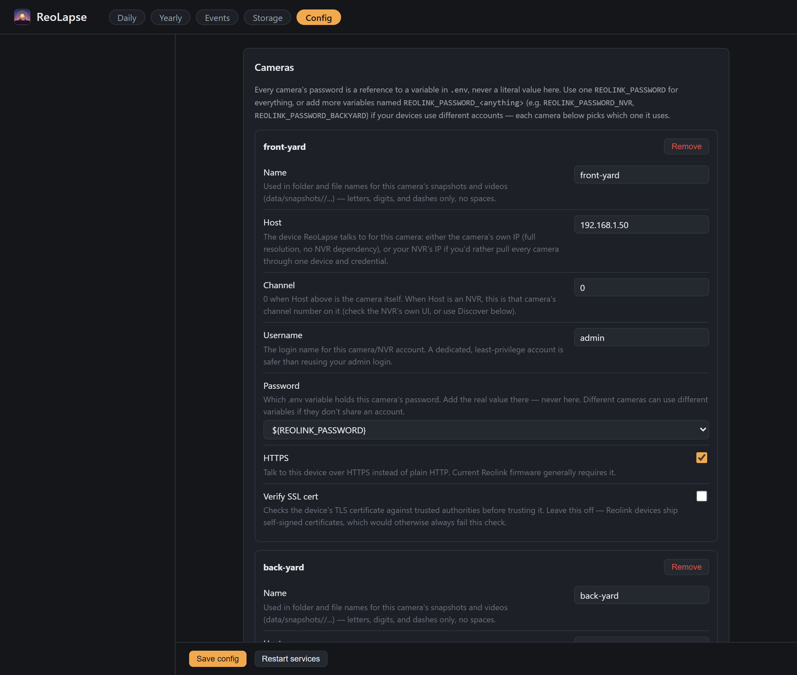
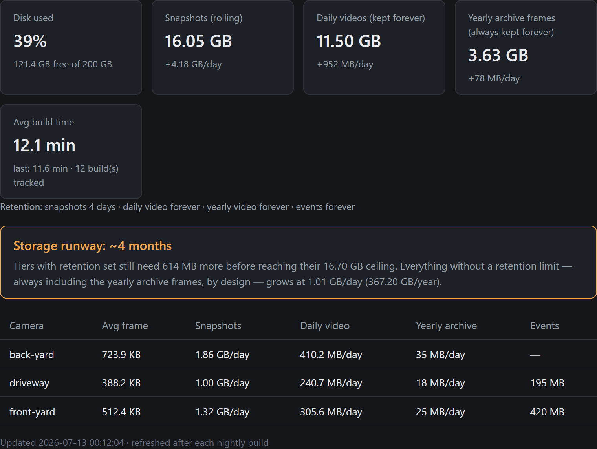

<p align="center">
  
</p>

<h1 align="center">ReoLapse</h1>

<p align="center">
  Turn your Reolink cameras (or NVR) into daily, yearly, and storm timelapses —<br>
  deflickered, weather-aware, and browsable from a small built-in web UI.
</p>

<p align="center">
  <a href="https://github.com/SeriesOfTubez/reolapse/actions/workflows/security.yml"></a>
  <a href="LICENSE"></a>
  
</p>

ReoLapse polls a snapshot from each camera on an interval, builds a
deflickered **daily** video per camera, archives frames into an ever-growing
**yearly** "changing seasons" video, and — when severe weather rolls in —
captures faster and cuts a dedicated **event** clip. Everything is browsable
through a bundled single-page web app.

<p align="center">
  
  <br>
  <em>A slice of one daily timelapse — pre-dawn to sunrise, captured on an interval through an NVR and built automatically overnight.</em>
</p>

> **Two things to know before you run this:** the web UI has no login by
> default — video browsing is always open, and the Config page has an
> optional passcode (see [Security](#security) — this is a LAN tool, don't
> expose it to the internet), and this project was built with AI assistance (see
> [AI-assisted development](#ai-assisted-development) for what that means and
> what's checked before anything ships).

---

## Features

- **Daily timelapses** per camera, with ffmpeg `deflicker` to tame
  auto-exposure flicker.
- **Yearly "seasons" timelapse.** Frames are archived hourly and kept forever;
  the yearly video is rendered from a configurable, re-tunable subset
  (e.g. 10 frames/day within daylight hours ≈ a 2-minute year). It holds off
  rendering until a configurable number of days have accumulated (30 by
  default) so you don't get a pointless two-second clip in the first week.
- **Weather-aware storm bursts.** Polls NWS alerts + Open-Meteo (free, no API
  keys). During storms/snow it captures every 10s instead of every 60s, and
  the nightly build cuts a per-storm clip.
- **Lunar event detection.** Computes full/blue/harvest moons and lunar
  eclipses (blood moon = total) locally via Skyfield — no location or API
  needed.
- **Upcoming-event forecast.** A Forecast tab looking 10 days ahead at storms,
  snow, and moon events, so you know what's worth pointing a camera at before
  it happens. Uses the same storm thresholds as live detection, and shows what
  the forecasts actually say rather than inventing a confidence score.
- **Season tagging.** Every frame and video is tagged with its astronomical
  season (spring/summer/fall/winter), hemisphere-aware — useful for filtering
  once a search UI exists, and it's what "changing seasons" is about anyway.
- **Frame & video tagging.** Active conditions (`storm`, `snow`, `rain`,
  `full-moon`, `blue-moon`, `harvest-moon`, `blood-moon`, `lunar-eclipse`,
  the season) are logged and embedded in each JPEG's comment and each video's
  metadata, so the data stays self-describing and searchable later.
- **PTZ-aware.** For auto-tracking cameras, frames captured away from the
  camera's home position are quarantined so they don't jerk the timelapse.
- **Direct or via NVR.** Talk to each camera directly, or pull every channel
  through one Reolink NVR with a single credential.
- **Bundled web UI.** Browse Daily / Yearly / Event videos per camera, with
  playback-speed controls and downloads. Range requests supported for seeking.
  Daily/event videos are grouped into a collapsible year/month tree once
  there are enough of them to need one.
- **Accent color.** Pick from six preset colors (`webapp.accent_color`) —
  amber (default), green, blue, red, purple, yellow.
- **Config page.** Edit `config.yaml` from the browser — every setting except
  secrets, which stay read-only and env-var-only. Includes network discovery
  to find Reolink cameras/NVRs on your LAN. See
  [Config page & network discovery](#config-page--network-discovery).
- **Forecast dashboard.** A Forecast tab lists the next 10 days of expected
  storms, snow, and moon events with the forecasts' own confidence signals.
  See [Forecast tab](#forecast-tab-whats-coming).
- **Storage dashboard.** A Storage tab shows per-camera and system-wide disk
  usage, growth rate, average build time, current retention settings, and a
  shortage/excess forecast — updated automatically after every nightly build.
  See [Storage estimates](#storage-estimates).
- **Configurable retention for every video tier.** Daily, yearly, and event
  videos default to being kept forever, but each has its own independent
  retention option if you'd rather bound disk usage.
- **Runs anywhere.** A Linux VM with systemd units, or Docker Compose.
- **Secrets stay out of the repo.** Credentials live in `.env`, referenced from
  config as `${VAR}`. Multiple cameras/NVRs with different accounts just get
  multiple `REOLINK_PASSWORD_*` variables — the Config page's password field
  lists whichever ones you've defined.

## Supported hardware

Any Reolink device that exposes the HTTP **`Snap`** CGI command — which is
essentially all current cameras and NVRs. It works both ways, so use whichever
is convenient:

- **Through an NVR** (`host` = NVR IP, `channel` = the camera's channel) — one
  host and one credential for every camera. Convenient for pulling several
  cameras, and needed if they sit on the NVR's isolated PoE network.
- **Directly** to a camera (`host` = camera IP, `channel: 0`) — no NVR
  dependency, and the only way to reach a lens the NVR doesn't expose (e.g. a
  dual-lens camera's second lens).

Both return the same full-resolution main-stream snapshot on current hardware
(verified on an RLN36 as byte-for-byte identical). Some older NVRs may hand
back a reduced-resolution snapshot for a channel — if you see that, pull that
camera directly instead.

Developed and tested against a Reolink **RLN36** NVR with **TrackMix WiFi**,
**OMVI 3i**, and **Video Doorbell WiFi** cameras (HTTPS, self-signed certs).
Other models exposing the same API should work; reports welcome.

> **Note on multi-lens cameras:** an NVR exposes one feed per camera. To
> capture a second lens (e.g. a dual-lens unit's wide + tele), address that
> camera directly and add each lens as its own `channel`.

> **Home Hub / Home Hub Pro (untested):** the Home Hub exposes the same CGI
> API and presents its cameras as channels behind the hub's IP, so in
> principle it should work exactly like an NVR — set `host` to the hub and a
> `channel` per camera. This is inferred from Reolink's API and the official
> Home Assistant integration (which fully supports the hubs); it hasn't been
> tested with ReoLapse yet, so reports are very welcome. **Caveat for battery
> cameras:** requesting a snapshot wakes a sleeping battery camera for
> 10–30s, so ReoLapse's interval polling would keep it awake and drain the
> battery fast. Only practical with **continuously-powered** cameras behind
> the hub (wired, or a battery cam left on permanent USB power).

## How it works

```
                 capture.py  ── Snap API ──►  cameras / NVR
                     │
     writes JPEGs +  ▼
     conditions log  data/snapshots/<cam>/<date>/<HHMMSS>.jpg
                     │
   build_timelapse.py│  (nightly + weekly)
                     ├─►  data/videos/<cam>/daily/<date>.mp4
                     ├─►  data/videos/<cam>/events/<date>_<tag>.mp4
                     ├─►  data/yearly_frames/<cam>/<year>/…   (kept forever)
                     ├─►  data/videos/<cam>/yearly/<year>.mp4
                     └─►  data/storage_stats.json  (storage_stats.py)
                     │
        webapp/app.py▼  serves the SPA + videos on :8080
```

Snapshots are pruned after `keep_snapshots_days`, but **only** once a day's
daily video exists — a missed build never silently loses a day. Yearly archive
frames are never pruned.

## Requirements

- Python 3.9+
- ffmpeg on `PATH`
- Reolink camera(s) and/or NVR reachable on your network
- A CPU exposing the **x86-64-v2** instruction baseline (SSE4.1, SSE4.2,
  POPCNT — needed by NumPy, which Skyfield uses for lunar event detection).
  Any real CPU from the last ~15 years has this. **Running in a VM (Proxmox,
  KVM, ESXi, etc.)?** Generic/portable virtual CPU types (e.g. Proxmox's
  default `kvm64`/`qemu64`, which reports as "Common KVM processor") often
  expose only SSE2 and will *not* meet this baseline — NumPy fails at runtime
  and lunar tagging silently stops working (everything else is unaffected).
  Set the VM's CPU type to `host` (passes through the physical CPU, best
  performance) or a synthetic type that guarantees v2+, such as
  `x86-64-v2-AES` or `x86-64-v3`, then reboot the VM. Verify with:
  `grep -o 'sse4_2\|popcnt' /proc/cpuinfo` — if that prints nothing, the
  baseline isn't met.

## Quick start (Docker)

```bash
git clone https://github.com/SeriesOfTubez/reolapse.git
cd reolapse

cp config.example.yaml config.yaml   # edit: cameras, location, options
cp .env.example .env                 # set REOLINK_PASSWORD

docker compose pull && docker compose up -d   # runs the latest release image
```

This pulls a pre-built multi-arch image (amd64 + arm64, so it works on a
Raspberry Pi) from `ghcr.io/seriesoftubez/reolapse`. `REOLAPSE_TAG` selects
which: `latest` (newest release, default), a pinned version like `0.2.0`, or
`edge` (latest development code from `main`) — e.g.
`REOLAPSE_TAG=edge docker compose pull && docker compose up -d`. Or **build
from source** instead, handy for local changes or unreleased code:

```bash
docker compose up -d --build
```

Open <http://localhost:8080>. Three services start: `capture` (continuous),
`scheduler` (nightly/weekly builds), and `web`. Keep `storage.root: ./data` in
`config.yaml` so data lands on the Docker volume. To upgrade later, see
[Upgrading](#upgrading).

## Install on a Linux VM (systemd)

For a Debian/Ubuntu host, the easy installer clones into `/opt/reolapse`, sets
up the virtualenv, installs and enables the systemd units, and starts the web
UI:

```bash
curl -fsSL https://raw.githubusercontent.com/SeriesOfTubez/reolapse/main/install.sh | bash
```

(Piping a script into your shell means running it unread — reasonable to
`curl -o install.sh` and skim it first.) Run it as a normal user with sudo,
not as root. It stops short of capturing — you still fill in `config.yaml`
and `.env` before starting the capture service; the script prints the exact
next steps.

For manual install steps, retargeting the systemd units to your user/path,
the optional Config-page Restart button, and env-var install options, see the
[Installation](https://github.com/SeriesOfTubez/reolapse/wiki/Installation)
wiki page.

## Upgrading

Upgrades only touch code — `config.yaml`, `.env`, and `data/` are never
touched.

```bash
curl -fsSL https://raw.githubusercontent.com/SeriesOfTubez/reolapse/main/upgrade.sh | bash
```

Docker: `docker compose pull && docker compose up -d` (or `git pull` first to
refresh the compose file). Pinning a version, tracking `main`, and what each
path preserves are on the
[Installation](https://github.com/SeriesOfTubez/reolapse/wiki/Installation#upgrading)
wiki page.

## Configuration

Everything lives in `config.yaml` (copy from `config.example.yaml`); secrets
don't — reference them as `${VAR}` and put the real values in `.env`. See the
inline comments in `config.example.yaml`, or the
[Configuration Reference](https://github.com/SeriesOfTubez/reolapse/wiki/Configuration-Reference)
wiki page for every field explained.

## Config page & network discovery

The **Config** tab edits `config.yaml` from the browser — every setting
except secrets, which stay read-only and env-var-only. Passwords are always
shown as a `${VAR}` dropdown, never a real value. It also includes network
discovery to find Reolink cameras/NVRs on your LAN.

<p align="center">
  
</p>

What's preserved on save, the Restart-services button, the optional passcode,
and how discovery works are on the
[Configuration Reference](https://github.com/SeriesOfTubez/reolapse/wiki/Configuration-Reference#config-page--network-discovery)
wiki page.

## Storage estimates

<p align="center">
  
</p>

Raw snapshots are a bounded rolling window, but daily/yearly/event videos
default to being kept forever — a reference 3-camera deployment grows about
**0.9 GB/day** under those defaults. The Storage tab shows your live usage
and a shortage/headroom forecast. Full sizing numbers and the retention math
are on the
[Storage & Performance](https://github.com/SeriesOfTubez/reolapse/wiki/Storage-and-Performance#storage-estimates)
wiki page. Spot a junk video? A **delete** button next to **download** in the
player removes it from disk — see
[Deleting a video by hand](https://github.com/SeriesOfTubez/reolapse/wiki/Storage-and-Performance#deleting-a-video-by-hand)
for what's regenerable and what isn't.

## Performance

Reference deployment: a 1 vCPU / 1 GB RAM VM builds 3 cameras' worth of daily
video in about 45–50 minutes; encoding is the bottleneck and threads across
available cores. See the
[Storage & Performance](https://github.com/SeriesOfTubez/reolapse/wiki/Storage-and-Performance#performance)
wiki page for tuning options and what the Storage tab tracks for your own
hardware.

## Usage

```bash
# One-off / manual builds (the scheduler or systemd timers do these for you):
python build_timelapse.py daily                       # yesterday, all cameras
python build_timelapse.py daily --date 2026-07-04 --camera front-yard
python build_timelapse.py yearly --year 2026
python build_timelapse.py events --date 2026-07-15    # rebuild event clips

python capture.py --loop        # continuous capture (service/container does this)
python webapp/app.py            # serve the web UI
```

## Weather tagging & storm bursts

With a location set, ReoLapse polls NWS + Open-Meteo and tags
`storm`/`snow`/`rain` conditions, triggering faster burst capture and a
per-event clip. Storm detection corroborates five independent signals rather
than trusting a single weather code, since thunderstorm conditions are
otherwise under-reported — a real deployment logged zero storm tags over 19
days of repeated storms before this. See the
[Weather & Storm Detection](https://github.com/SeriesOfTubez/reolapse/wiki/Weather-and-Storm-Detection)
wiki page for how detection works and how API outages are handled. Those
same burst frames make the daily video crawl through a storm hour by
default; `daily_video.include_events` controls whether they're woven in or
left out — see
[Event frames in the daily video](https://github.com/SeriesOfTubez/reolapse/wiki/Weather-and-Storm-Detection#event-frames-in-the-daily-video).

## Lunar event detection

With `events.lunar_enabled: true`, ReoLapse computes real full/blue/harvest
moons and lunar eclipses locally via Skyfield — no location or API required
for the phase tags. See the
[Lunar & Season Tagging](https://github.com/SeriesOfTubez/reolapse/wiki/Lunar-and-Season-Tagging)
wiki page for eclipse visibility rules and requirements.

## Forecast tab (what's coming)

The **Forecast** tab looks 10 days ahead at storms, snow, and moon events
using the same detection thresholds as live capture, without a made-up
confidence score — just what the forecasts actually say and whether the two
sources agree. See the
[Forecast Tab](https://github.com/SeriesOfTubez/reolapse/wiki/Forecast-Tab)
wiki page for the full breakdown.

## Season tagging

With `events.season_enabled: true`, every frame and video is tagged with its
real astronomical season (computed from the actual equinox/solstice
instants, hemisphere-aware). See the
[Lunar & Season Tagging](https://github.com/SeriesOfTubez/reolapse/wiki/Lunar-and-Season-Tagging#season-tagging)
wiki page for details.

## PTZ cameras

For auto-tracking cameras, capture checks each frame's pan/tilt against a
configured home position and quarantines off-home frames so they don't jerk
the timelapse. See the
[PTZ & Night Capture](https://github.com/SeriesOfTubez/reolapse/wiki/PTZ-and-Night-Capture)
wiki page for setup.

## Night capture & IR cameras

IR cameras cause a jarring color-to-black-and-white transition twice a day in
a 24-hour timelapse. ReoLapse can capture daylight-only (or night-only) on a
schedule computed fresh from real sunrise/sunset, per camera if needed. See
the
[PTZ & Night Capture](https://github.com/SeriesOfTubez/reolapse/wiki/PTZ-and-Night-Capture#night-capture--ir-cameras)
wiki page for the daylight/night-mode options and per-camera schedules.

## Security

**There is no authentication.** The web UI has no login — anyone who can
reach port 8080 can browse and download every video, and the Config page can
rewrite `config.yaml`. **ReoLapse is a LAN-only tool — do not expose it to
the internet.** An optional passcode can gate the Config page (video browsing
stays open); see the
[Security](https://github.com/SeriesOfTubez/reolapse/wiki/Security)
wiki page for the full threat model, what the passcode does and doesn't
protect, and VPN/reverse-proxy guidance for remote access.

## AI-assisted development

This project was built with AI pair-programming assistance (Claude, via
Claude Code) under human direction and review — most of the code and docs were AI-generated. If that's a dealbreaker for you,
that's a reasonable position; here's what's in place either way so you can
judge for yourself rather than take it on faith:

- **CI runs security scanning on every push and PR** (see the badge at the
  top of this README, and [`.github/workflows/security.yml`](.github/workflows/security.yml)):
  [Gitleaks](https://github.com/gitleaks/gitleaks) for committed secrets,
  [Semgrep](https://semgrep.dev/) for static analysis, and
  [Trivy](https://trivy.dev/) for dependency vulnerabilities, container image
  CVEs, and Dockerfile/IaC misconfiguration.
- Those scans have already changed real decisions in this repo — e.g. the
  Docker base image is Alpine instead of Debian-slim specifically because
  Trivy found hundreds of unfixed CVEs in the latter.
- All source is here to read; nothing is obfuscated, minified, or vendored
  without attribution. Issues and PRs are welcome, especially bug reports —
  AI assistance doesn't mean the code is beyond scrutiny, it means you get to
  scrutinize it instead of trusting a vendor's black box.

## Roadmap / ideas

- Re-encode old dailies at a lower bitrate instead of deleting them outright,
  as an alternative to `daily_video.retention_days` — see
  [Storage estimates](#storage-estimates).
- All-sky / long-exposure night camera support (Raspberry Pi HQ + Allsky).
- Object-storage (S3/Garage) backend for videos.
- Parallelize daily builds across cameras (currently sequential — see
  [Performance](#performance)).

## Contributing

Issues and PRs welcome — especially reports of which Reolink models work. Keep
changes focused and match the existing style.

Wiki pages live in [`wiki/`](wiki/) in this repo and are published to the
GitHub wiki automatically when a release tag is pushed — **edit them there in
a PR, not in the browser**, or your changes will be overwritten by the next
release.

## License

MIT — see [LICENSE](LICENSE).
